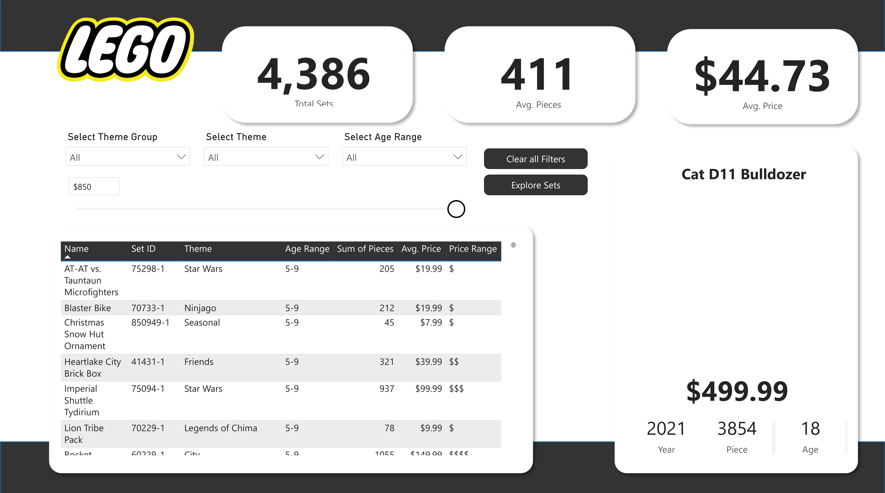
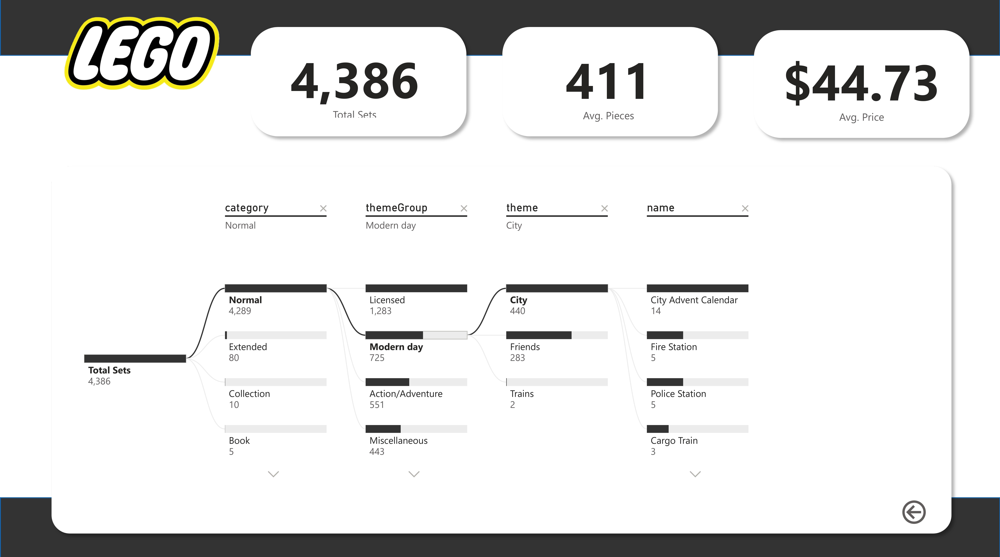

# 🧱 LEGO Set Explorer Dashboard (Power BI)

An interactive Power BI dashboard to explore LEGO sets across **themes, age groups, prices, and piece counts**.  
This project focuses on clean UI, strong filtering experience, and easy drill-down analysis from category level to individual sets.

---

## 🔥 Dashboard Preview

### Overview + Set Details Explorer

### Decomposition Tree Exploration

---

## 📌 Key Highlights

- ✅ **KPI Summary**
  - Total Sets
  - Average Pieces
  - Average Price

- ✅ **Interactive Filtering**
  - Theme Group
  - Theme
  - Age Range
  - Price filtering

- ✅ **Set-Level Table**
  - Set Name, Set ID, Theme, Age Range
  - Piece count
  - Price and price range

- ✅ **Decomposition Tree Analysis**
  - Drill down: `Category → Theme Group → Theme → Set Name`
  - Quickly discover top/bottom contributing segments

---

## 🛠 Tools & Skills Used

- **Power BI**
- **Power Query (Data Cleaning & Shaping)**
- **Data Modeling**
- **DAX Measures**
- **Dashboard UI/UX Design**
- **Interactive Reporting (Filters, Drill-down)**

---

📈 Measures (Examples)

Some measures typically used in this dashboard:

Total Sets

Average Pieces

Average Price

Price Range Labeling (bucketed pricing for quick segmentation)

If you want, I can also write the exact DAX measures once you share your column names.

🚀 How to Use

Download or clone this repository.

Open the .pbix file in Power BI Desktop.

Use slicers (Theme Group / Theme / Age Range) to explore insights.

Navigate the decomposition tree to drill down and identify patterns.

💡 Insights You Can Explore

Which themes have the highest average piece count?

Which theme groups contain the most sets?

How price varies by age range and theme

Identifying high-value sets (high pieces + high price)

📬 Connect With Me

If you liked this project or want to collaborate:

LinkedIn: https://www.linkedin.com/in/shahinshabab

Portfolio/GitHub: https://github.com/shahinshababp

⭐ Support

If you find this useful, consider giving the repository a ⭐ to support my work!